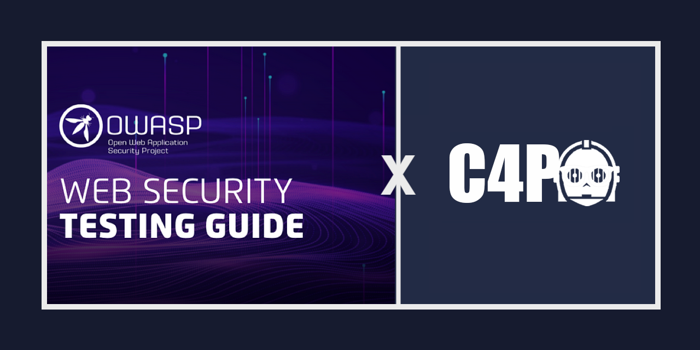
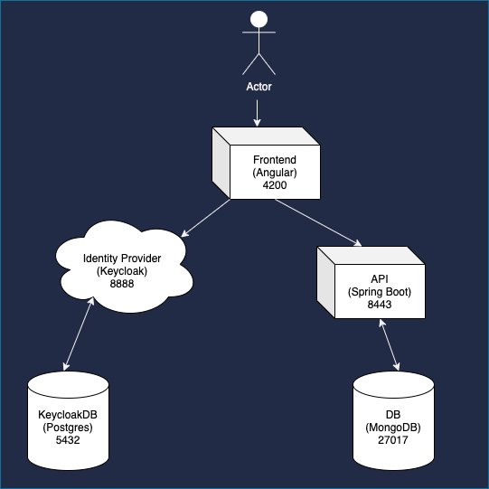
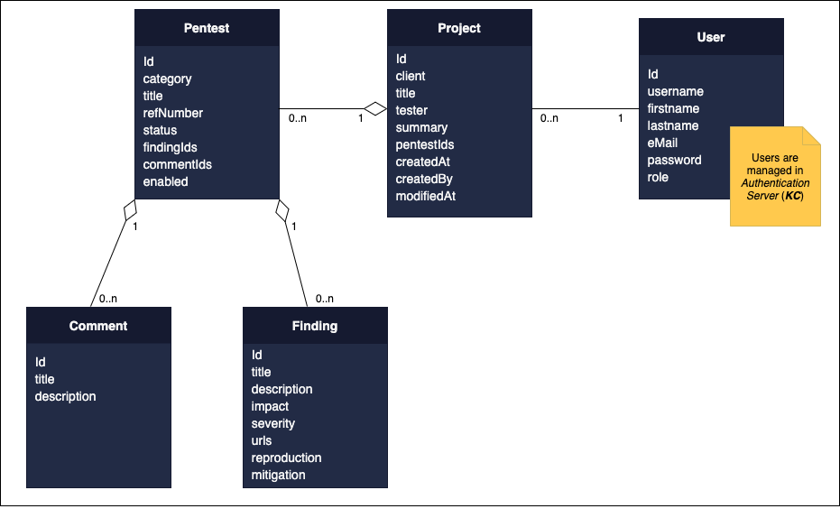
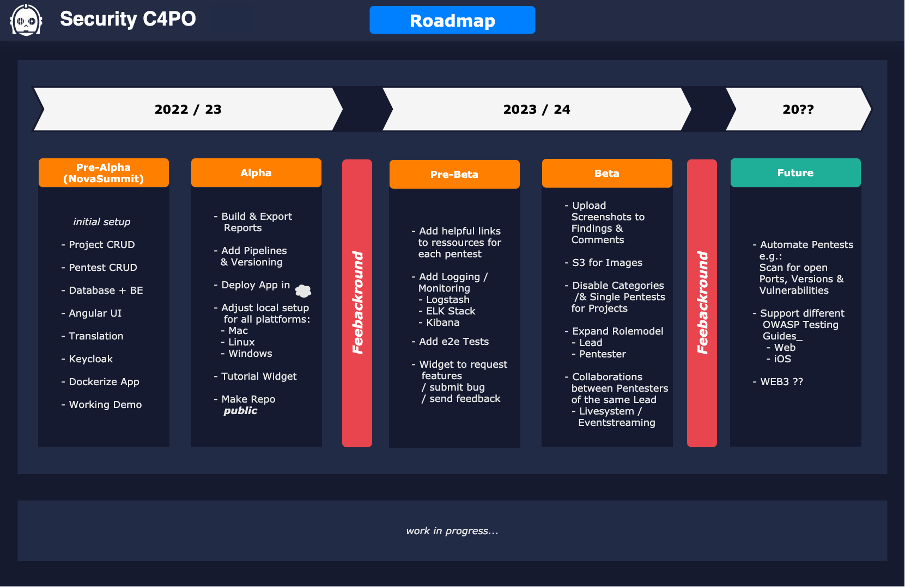

Welcome to the frontend repository of Security C4PO, an open-source pentest reporting tool.
Security C4PO is a powerful, user-friendly tool designed to simplify the process of generating professional pentest reports.
It aims to streamline and automate the often time-consuming task of creating comprehensive reports by providing an intuitive web-based interface that facilitates the content of the [OWASP TESTING GUIDE](https://owasp.org/www-project-web-security-testing-guide/v42/).

This repository contains the codebase of Security C4PO, built with an Angular Frontend and two Spring Boot Backend Microservices.

## Table of Contents
* [Docker Hub Setup](#docker-hub-setup)
* [Application Architecture](#application-architecture)
* [Data Structure](#data-structure)
* [C4PO Roadmap](#c4po-roadmap)
* [Project](#project)
  * [Technical Requirements](#technical-requirements)
  * [Tools](#tools)
  * [Conventions](#conventions)
  * [Development server](#development-server)
  * [Testuser Credentials](#testuser-credentials)
* [Contributing](#contributing)
* [License](#license)

## Docker Hub Setup

* Pull all images:
  * `docker image pull --all-tags cellecram/security-c4po`
* Create network: 
  * `docker network create -d bridge c4po
* Start images:
  * `docker run --network=c4po --name c4po-keycloak -d -p 8080:8080 cellecram/security-c4po:keycloak`
  * `docker run --network=c4po --name c4po-db -d -p 27017:27017 cellecram/security-c4po:mongo`
  * `docker run --network=c4po --name c4po-angular -d -p 4200:4200 cellecram/security-c4po:angular`
  * `docker run --network=c4po -e "SPRING_PROFILES_ACTIVE=COMPOSE" --name c4po-api -d -p 8443:8443 cellecram/security-c4po:api`
  * `docker run --network=c4po -e "SPRING_PROFILES_ACTIVE=COMPOSE" --name c4po-reporting -d -p 8444:8444 cellecram/security-c4po:reporting`

### OR: Run Script (Docker Hub)
Execute `c4po-prod.sh` and all services will be pulled from Docker Hub and started.
You can reach the application by entering http://localhost:4200 in you browser.
  
## Application Architecture

## Data Structure

## C4PO Roadmap

## Project

### Technical Requirements
* Docker / Docker-compose
* OpenJDK 11
* Node 14.15.1 / npm 6.14.8
* MongoDB 4.4.6

### Tools
* mongoDB Compass
* Postman
* Jaspersoft Studio

### Conventions
* Branch: `<initial>_c4po_<issuenumber>`
* Commit: `feat: <What was implemented?>` or `fix: <What got fixed?>`

### Development server
Execute `c4po-dev.sh` and all services will run on a dev server.
You can reach the application by entering http://localhost:4200 in you browser.

### Testuser Credentials
* Username: c4po
* Password: Test1234!

## Contributing
Contributions to Security C4PO are welcome! If you'd like to contribute to the project, please follow the guidelines outlined in the [CONTRIBUTING.md](https://github.com/marcel-haag/security-c4po/blob/main/CONTRIBUTING.md) file.

## License
Security C4PO is licensed under the [Apache License 2.0](https://www.apache.org/licenses/LICENSE-2.0) License. Please see the [LICENSE](https://github.com/marcel-haag/security-c4po/blob/main/LICENSE.md) file for more information.

We hope you find Security C4PO useful for managing and generating pentest reports. If you encounter any issues or have suggestions for improvement, please feel free to create an issue on the [issue tracker](https://github.com/Marcel-Haag/security-c4po/issues).
