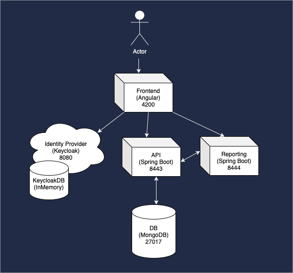
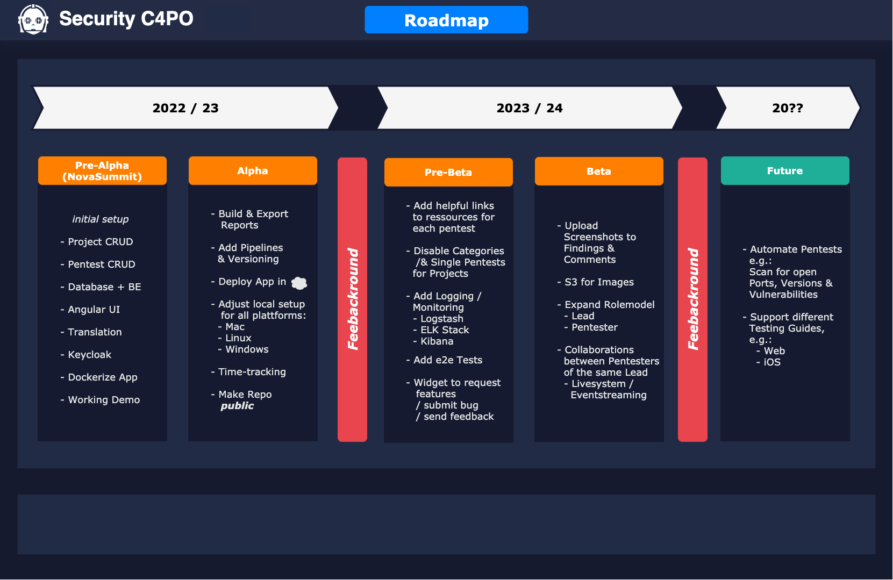

# security-c4po

### Chief Innovator
> Daniel Mader

### Project Leads
* Andreas Falk
* Christina Paule

### Developers
* Marcel Haag
* Norman Schmidt
* Stipe Knez

### Technical Requirements
* Docker / Docker-compose
* OpenJDK 11
* Node 14.15.1 / npm 6.14.8
* MongoDB 4.4.6

### Tools
* mongoDB Compass
* Postman

## Application Architecture

## Data Structure

### Conventions
* Branch: `<initial>_c4po_<issuenumber>`
* Commit: `feat: <What was implemented?>` or `fix: <What got fixed?>`

### Development server
Execute 'c4po.sh' and all services will run on a dev server.

### Testuser Credentials:
* Username: ttt
* Password: Test1234!

## C4PO Roadmap

