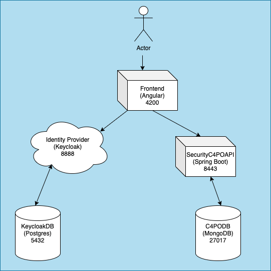

# security-c4po

## Project Members
* Daniel Mader
* Marcel Haag

## Technical Requirements
* Docker / Docker-compose
* OpenJDK 11
* Node 14.15.1 / npm 6.14.8

## Tools
* mongoDB Compass
* Postman

## Conventions
* Branch: `<initial>_c4po_<issuenumber>`
* Commit: `feat: <What was implemented?>` or `fix: <What got fixed?>`

## Development server
Execute 'c4po.sh' and all services will run on a dev server.

## Testuser Credentials:
* Username: ttt
* Password: Test1234!

## Architecture

